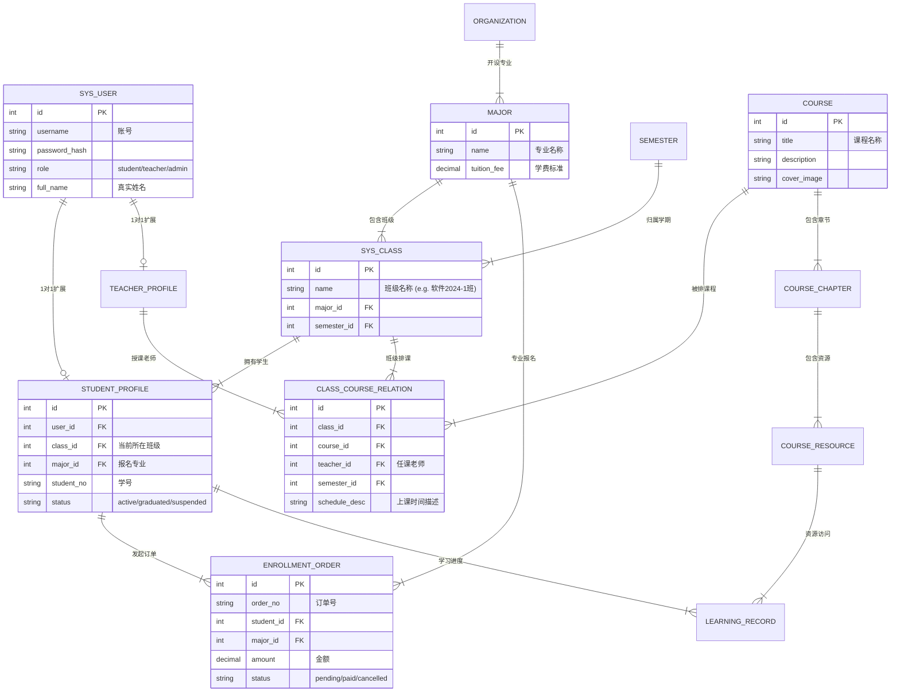

# 智能在线学习系统 - 数据库模型设计 (Database Schema)

## 1. 设计思路
基于“班级制”教学模式设计，核心逻辑链条为：**学生 -> 归属班级 -> 关联课程**。

*   **用户体系**：统一使用 `sys_user` 存储账号信息，通过扩展表 (`student_profile`, `teacher_profile`) 存储角色特定数据。
*   **教务核心**：
    *   `major` (专业) 是报名和缴费的实体。
    *   `sys_class` (班级) 是学生管理的实体。
    *   `class_course_relation` (班级排课) 是连接 班级、课程、教师 的核心纽带。

---

## 2. 实体关系图 (ER Diagram)



---

## 3. 核心表结构说明 (Core Tables)

### 3.1 基础模块
| 表名 | 说明 | 关键字段 |
| :--- | :--- | :--- |
| `sys_user` | 系统用户 | `id`, `username`, `role` (admin, teacher, student), `avatar`, `created_at` |
| `sys_dict` | 数据字典 | `code`, `label`, `value` (用于存储静态选项如资源类型) |
| `semester` | 学期管理 | `name` (2024秋), `start_date`, `end_date`, `is_current` |

### 3.2 教务模块 (Enrollment & Class)
| 表名 | 说明 | 关键字段 |
| :--- | :--- | :--- |
| `organization` | 学校/机构 | `name`, `parent_id` (支持树形结构) |
| `major` | 专业信息 | `org_id`, `name`, `tuition_fee` (学费), `duration` (学制) |
| `sys_class` | 班级信息 | `major_id`, `semester_id`, `head_teacher_id` (班主任) |
| `student_profile`| 学生档案 | `user_id`, `class_id`, `major_id`, `enrollment_date` |
| `enrollment_order`| 报名订单 | `student_id`, `major_id`, `total_amount`, `pay_status`, `pay_time` |

### 3.3 教学模块 (Teaching & Course)
| 表名 | 说明 | 关键字段 |
| :--- | :--- | :--- |
| `course` | 课程基础 | `title`, `code`, `credits` (学分), `intro` |
| **`class_course_relation`** | **班级排课(核心)** | **`class_id`, `course_id`, `teacher_id`**, `semester_id` |
| `course_chapter` | 课程章节 | `course_id`, `title`, `sort_order`, `parent_id` (支持子章节) |
| `course_resource` | 课程资源 | `chapter_id`, `type` (video/ppt/doc), `file_url`, `duration` |

### 3.4 学习与互动 (Learning)
| 表名 | 说明 | 关键字段 |
| :--- | :--- | :--- |
| `learning_record` | 学习记录 | `student_id`, `resource_id`, `progress` (进度%), `last_position` (秒) |
| `course_qa` | 课程问答 | `course_id`, `student_id`, `title`, `content`, `reply_count` |
| `homework_submission` | 作业提交 | `assignment_id`, `student_id`, `content`, `score`, `teacher_comment` |

---

## 4. 关键业务查询逻辑示例

**Q: 学生登录后，如何获取“我的课程”列表？**

```sql
SELECT 
    c.title, c.cover_image, t.full_name as teacher_name
FROM 
    student_profile s
JOIN 
    class_course_relation ccr ON s.class_id = ccr.class_id  -- 1. 找到学生所在班级的排课记录
JOIN 
    course c ON ccr.course_id = c.id                        -- 2. 关联课程详情
JOIN 
    sys_user t ON ccr.teacher_id = t.id                     -- 3. 关联任课老师
WHERE 
    s.user_id = :current_user_id;
```

